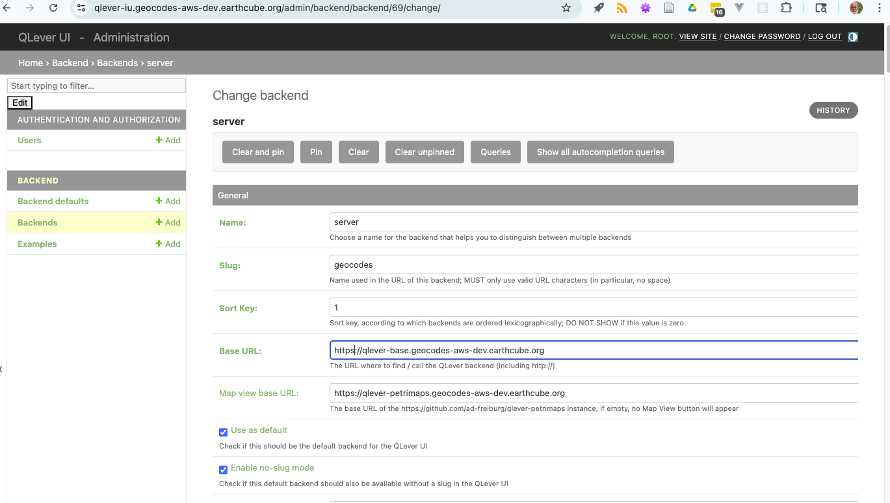

# Deployment for Portainer.

# Three containers run:
* qlever-base.{HOST}
* qlever-ui.{HOST}
* qlever-petrimaps.{HOST}

use the qlever_services.yml for now.

Deploy with cut and paste for now.

| Variable      | default | note |
|---------------| --------| ------|
| HOST          | the host, | eg geocodes-aws-dev.earthcube.org |
| PROJECT       | geocodesexamples | the namespace for objects in portainer and traefik |
| QLEVER_CONFIG | geocodesexamples | name of the docker config | 
| QLEVER_NET    |  base | base namespace for that the qlevels might talk over |

# CONFIGURING THE UI
* initially the UI admin
* log into console in portainer/docker
* `python manage.py makemigrations --merge && python manage.py migrate`
* `./manage.py createsuperuser`
   * note this can be automated... 
* then go to the UI admin page in web browser: https://qlever-iu.geocodes-aws-dev.earthcube.org/admin
  * add the url, with the full path, since users will be using this.
  `https://qlever-base.geocodes-aws-dev.earthcube.org`
  * be ure that the Sort Key is NOT ZERO
  * map base (needs to be tested):
  `https://qlever-petrimaps.geocodes-aws-dev.earthcube.org`
  
 

## Untested. Run an additional container using qlever_namespace.yaml
