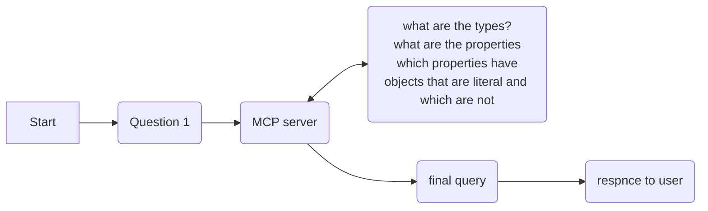

# MCP for Qlever triplestore

## About

TBD
## Docker command

```bash
docker build -t mcp-app .
```

```bash
docker run -p 8898:8898 mcp-app
```

## TODO

- [ ] Add in the mardown from SOSO:  https://github.com/ESIPFed/science-on-schema.org/blob/main/guides/Dataset.md 
- [ ] Question:
  - [ ] It seems that what I really want when I have many of these, is to think about the shared PIDs and then also how to quickly find them.  If a PID pattern is part of schema:identifier, then that should not be too hard.   Perhaps shared Orgs, people, creative work, etc. is a good touch point.  
  - [ ]  Given a description, pull entities?   Or assertions?
- [ ] Leverage BAML to make the SPARQL.   This would be a case of identifying key
elements of a SPARQL query / template that could be extracted to leverage BAMLs structured approach.

- [ ] We Need to look at https://github.com/open-webui/mcpo and see if we can leverage it for our own purposes.  It exposes MCP as OpenAPI, might be fun to add just to see how well it works (if at all).


## FastMCP

Reference https://gofastmcp.com/getting-started/welcome and go to the tools section.

Example json entry for server local

```json{
  "mcpServers": {
    "rdf-query-server": {
      "url": "http://localhost:8898/sse",
      "env": {}
    }
  }
}
```

### Resources

See https://gofastmcp.com/servers/resources#accessing-mcp-context

This is where I can provide:
* system state information

### Context
https://gofastmcp.com/servers/context#llm-sampling

could I use this with BAML to "sampel" some of the data and
get a structured result I could use?

https://gofastmcp.com/servers/context#http-requests

http request for any distributions found to do further work 
with.

"get the distribution from resource X and analyze it."

### Prompts
https://gofastmcp.com/servers/prompts#required-vs-optional-parameters

One idea would be that a distribution can be accessed and then run through the LLM leveragint the prompts I used in biohack to pull back the assertions
and operate on those.   


## Tools
To set this up in claude cli, use 

```bash
 claude mcp add --transport sse oih-qlever http://localhost:8898/sse
 ```

## Notes

```bash
`npx @modelcontextprotocol/inspector uvx
````

Connect to, for example: http://localhost:8898/sse

## MCP session with graph

- MCP server needs to provide tools and data and prompts of relevance.
- I am looking for X
- MCP takes the request and looks for tools and data and prompts to help address the request, responds with types available and the description of them.
  - can I get the types related to the question?
  - can I get the properties on the type(s) that are literal and not
  - Form a query for the types and properties that have literal objects
  - form a query for the types and properties that have IRI objects (repeat the above?)
  - It would be nice if we could leverage vector search.  Could do this in KuzuDB, for example.  Kuzu can also do full-text search.  
  - Could imagine a "Course questions" client that leverages the KG and other 


