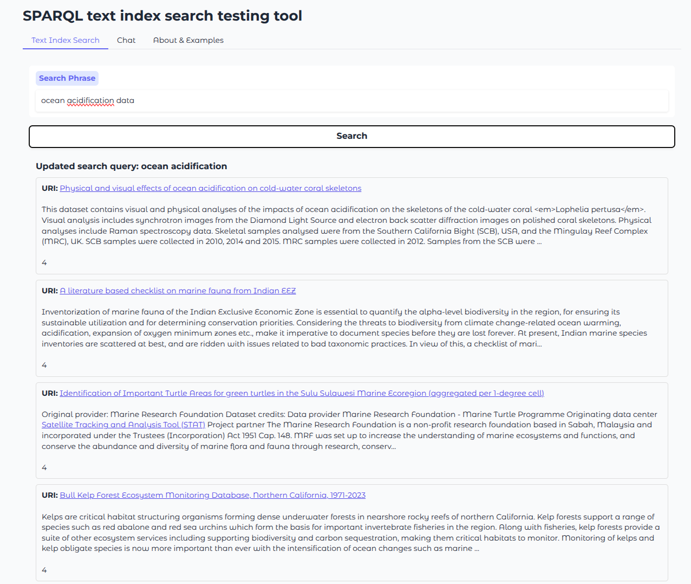

# Testing UI

## About

Just some code for a simple Gradio based UI for testing.  The query_prep.py is some thoughts on
shaping free text query strings into something more aligned with the Qlever text index approach.



## Notes

References:
* https://github.com/ad-freiburg/qlever/blob/master/docs/sparql_plus_text.md

```sparql
PREFIX rdf: <http://www.w3.org/1999/02/22-rdf-syntax-ns#>
PREFIX skos: <http://www.w3.org/2004/02/skos/core#>
PREFIX gn: <https://www.geonames.org/ontology#>
PREFIX text: <http://jena.apache.org/text#>
PREFIX vrank: <http://purl.org/voc/vrank#>
PREFIX ql: <http://qlever.cs.uni-freiburg.de/builtin-functions/>
PREFIX gn: <https://www.geonames.org/ontology#>

SELECT ?uri (COUNT(?text) AS ?count) (SAMPLE(?text) AS ?example_text) ?item  WHERE { 
    ?uri rdf:type <https://schema.org/Person> .
    ?uri <https://schema.org/name> ?item .
    ?text ql:contains-entity ?item .
    ?text ql:contains-word "Arno" .
    FILTER (!CONTAINS(STR(?uri), "gleaner.io"))
    FILTER (!isBLANK(?uri))
}
GROUP BY ?uri ?item
```